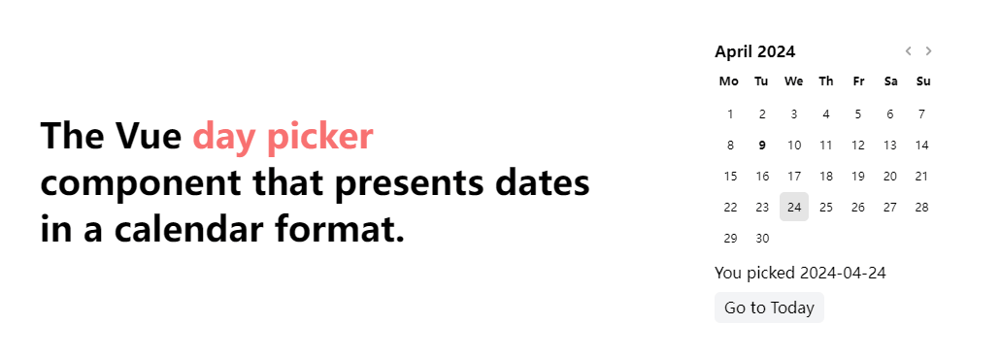

<p align=center>
<a href="https://github.com/AntzyMo/vue-day-calendar"></a>
</p>

<h1 align="center">
vue-day-calendar
</h1>

<p align="center">
<a href="https://github.com/AntzyMo/vue-day-calendar">English</a> | 中文
</p>

<p align="center">
<a href="https://daycalendar.antzy.me">📚️ 文档</a>
</p>


`day-calendar` 是 `Vue` 日期选择组件，以日历的方式去呈现，它具有简洁的外观，并且支持 `tailwindcsss` 和 `unocss` 可定制化样式修改.




## ✨ 功能特点
-  选择日期、范围或其他
-  以选择日期为主要的日历组件
-  使用 [dayjs](https://dayjs.gitee.io/zh-CN) 作为日期库
-  国际化多语言
-  高度可定制化样式


## 安装
```shell
pnpm add vue-day-calendar dayjs
```

## 例子
```vue
<script setup lang="ts">
  import 'vue-day-calendar/style.css'
  import VueDayCalendar from 'vue-day-calendar'
</script>

<template>
  <VueDayCalendar/>
</template>
```

## 贡献指南
如果在使用过程中发现问题，欢迎提交 [issue](https://github.com/AntzyMo/vue-day-calendar/issues) 或 **pull request** 并第一时间解决，如果喜欢的话，欢迎 **star** 一下。
  

## License
[MIT](./LICENSE) License &copy; 2024-PRESENT [AntzyMo](https://github.com/AntzyMo)


