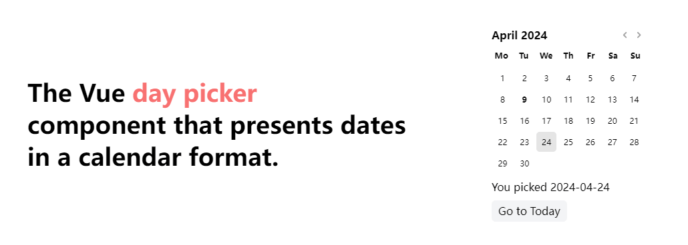

<p align=center>
<a href="https://github.com/AntzyMo/vue-day-calendar"></a>
</p>

<h1 align="center">
vue-day-calendar
</h1>

<p align="center">
English | <a href="README-CN.md">中文</a>
</p>

<p align="center">
<a href="https://daycalendar.antzy.me">📚️ Documentation</a>
</p>

`day-calendar` is a `Vue` date picker component that presents dates in a calendar format. It features a clean appearance and supports customizable styling with `tailwindcss` and `unocss`.




## ✨ Main features
-  Select days, ranges or whatever
-  A calendar component focused on date selection
-  Using [dayjs](https://dayjs.gitee.io/en) as the date library
-  Localizable into any language
-  Easy to style and customize


## Installation
```shell
pnpm add vue-day-calendar dayjs
```

## Example
```vue
<script setup lang="ts">
  import 'vue-day-calendar/style.css'
  import VueDayCalendar from 'vue-day-calendar'
</script>

<template>
  <VueDayCalendar/>
</template>
```

## Contribution guide
If you encounter any problems during use, feel free to submit an [issue](https://github.com/AntzyMo/vue-day-calendar/issues) or **pull request**, and we will resolve it as soon as possible, if you like it, please **star** it.


## License
[MIT](./LICENSE) License &copy; 2024-PRESENT [AntzyMo](https://github.com/AntzyMo)


